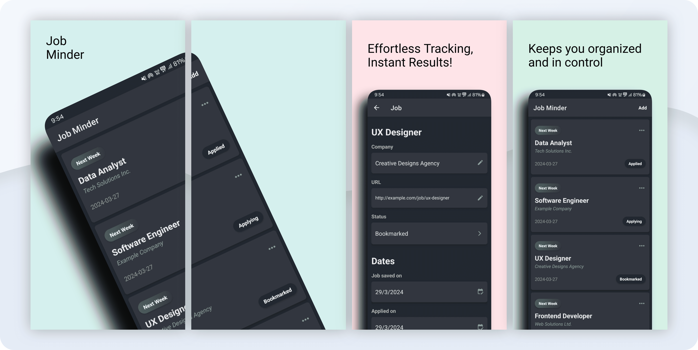

<h1 align="center">
   
  
   
  Job Minder
   
</h1>

<h4 align="center">Efficiently track job applications with our <a href="https://reactnative.dev/" target="_blank">React Native</a> powered Android app.</h4>

  <a href="#key-features">Key Features</a> •
  <a href="#how-to-install">How To Install?</a> •
  <a href="#credits">Credits</a> •
  <a href="#license">License</a>

## Key Features

- **Job Entry Form**: User-friendly input for job title, company name, application status, and relevant details.
- **Application Status Tracking**: Track application status: applied, in review, interview scheduled, offer received, rejected.
- **Follow-Up Dates**: Set follow-up dates for organized communication with employers.
- **Custom Notes**: Add personal notes to each application for reflections and feedback.

## How to install?

You can [download](https://github.com/HashHazard/Job-Minder/releases/download/v0.1.0-alpha/job_minder.apk) the latest installable version of Job Minder for Android.

## Credits

This software uses the following open source packages:

- [React Native](https://reactnative.dev/)
- [Sqlite3](https://www.sqlite.org/)
- [Expo](https://expo.dev/)

## License

[MIT](./LICENSE)
